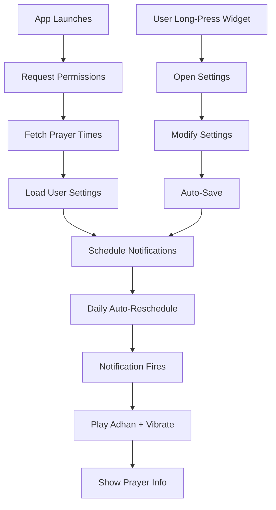

# Adhan Notifications - Quick Start Guide

## Launch Note (Jan 2026)

The in-app "Test Notification" button was removed before launch.
Use `NOTIFICATION_LAUNCH_QA_CHECKLIST.md` to validate Adhan notifications end-to-end (timing, sound/vibration behavior, and tap → Prayer Guidance).

## 🚀 Get Started in 60 Seconds

### For Users

1. **Grant Permissions** (First Launch)
   - App asks for notification permissions → Tap "Allow"
   - App asks for location permissions → Tap "Allow While Using"

2. **Automatic Setup**
   - Prayer times load automatically based on your location
   - All 5 prayers enabled by default
   - Default adhan sound selected

3. **Customize** (Optional)
   - Long-press the **Prayer Times widget** on home screen
   - Settings screen opens
   - Adjust volume, select adhan, enable/disable prayers

4. **Verify It**
   - Wait for the next upcoming prayer notification
   - Verify the notification appears and tapping it opens **Prayer Guidance**
   - Done! ✅

### For Developers

1. **Files to Know**
   ```
   services/AdhanNotificationService.ts  → Core logic
   app/adhan-settings.tsx                → Settings UI
   components/home/widgets/PrayerTimesWidget.tsx → Widget integration
   ```

2. **How It Works**
   ```typescript
   // When prayer times load, auto-schedule:
   await schedulePrayerNotifications(prayerTimings);
   
   // Notifications scheduled for all enabled prayers
   // Background tasks ensure they fire even when app closed
   ```

3. **Customize Settings**
   ```typescript
   const settings = await loadSettings();
   settings.volume = 80;
   settings.adhanSound = 'mishary';
   await saveSettings(settings);
   await schedulePrayerNotifications(prayerTimes); // Reschedule
   ```

4. **Test Locally**
   ```bash
   # Run app
   npx expo start
   
   # Open adhan settings
   # Long-press Prayer Times widget
   
   # Tap "Test Notification"
   ```

## 📱 User Interface

### Home Screen
```
┌────────────────────────────────┐
│  Prayer Times Widget           │
│  🕌                            │
│  Next Prayer                   │
│  الظهر (Dhuhr)                 │
│  1:15 PM                       │
│  in 2h 30m                     │
│  Hold to configure             │ ← Long-press here
└────────────────────────────────┘
```

### Settings Screen
```
┌────────────────────────────────┐
│  ← Adhan Settings              │
├────────────────────────────────┤
│  Enable Adhan    [●───────]    │ ← Master toggle
│                                │
│  Prayer Notifications          │
│  Fajr           [●───────]     │
│  Dhuhr          [●───────]     │
│  Asr            [●───────]     │
│  Maghrib        [●───────]     │
│  Isha           [●───────]     │
│                                │
│  Volume (80%)                  │
│  [────●────────────────]       │
│                                │
│  Vibration      [●───────]     │
│                                │
│  Adhan Sound                   │
│  Mishary Al-Afasy  ▼           │
│                                │
│  Fajr Adhan                    │
│  Default Fajr      ▼           │
│                                │
│  Reminder (10 min)             │
│  [────────●────────────]       │
│                                │
│  [   Test Notification   ]     │
└────────────────────────────────┘
```

## ⚙️ Configuration Options

| Setting | Type | Range | Default | Description |
|---------|------|-------|---------|-------------|
| **enabled** | Toggle | ON/OFF | ON | Master switch for all notifications |
| **volume** | Slider | 0-100% | 80% | Adhan volume level |
| **vibrate** | Toggle | ON/OFF | ON | Vibration with notification |
| **adhanSound** | Select | 4 options | default | Sound for Dhuhr/Asr/Maghrib/Isha |
| **adhanSoundFajr** | Select | 4 options | default | Special sound for Fajr |
| **reminderMinutes** | Slider | 0-30 min | 10 min | Reminder before prayer |
| **enabledPrayers** | 5 Toggles | ON/OFF per prayer | All ON | Which prayers to notify |

### Adhan Sound Options
- **Default**: Traditional adhan
- **Mishary**: Mishary Rashid Al-Afasy
- **Mecca**: Adhan from Mecca
- **Medina**: Adhan from Medina

## 📊 Notification Flow



## 🔔 Notification Details

### What User Sees
```
┌────────────────────────────────┐
│ 🕌 Time for Dhuhr              │
│                                │
│ It's time for الظهر prayer    │
│                                │
│ [Swipe to dismiss]             │
└────────────────────────────────┘
```

### Technical Details
- **Title**: "Time for [Prayer Name]"
- **Body**: "It's time for [Arabic Name] prayer"
- **Sound**: Selected adhan (30-60 seconds)
- **Priority**: High
- **Category**: Alarm/Reminder
- **Badge**: None
- **Actions**: Dismiss (auto-clears)

## 🛠️ Common Tasks

### Change Adhan Sound
1. Long-press Prayer Times widget
2. Scroll to "Adhan Sound"
3. Tap dropdown
4. Select new sound
5. Done (auto-saves)

### Disable Specific Prayer
1. Long-press Prayer Times widget
2. Find prayer toggle (e.g., "Asr")
3. Tap to disable
4. Done (auto-saves)

### Adjust Volume
1. Long-press Prayer Times widget
2. Scroll to "Volume"
3. Drag slider left/right
4. Test with "Test Notification"
5. Done (auto-saves)

### Set Reminder
1. Long-press Prayer Times widget
2. Scroll to "Reminder"
3. Drag slider (0-30 minutes)
4. 0 = no reminder, 30 = 30 min before
5. Done (auto-saves)

## 🐛 Troubleshooting

### No Notifications?
```bash
✓ Check: Settings > Notifications > Asrār > Allow
✓ Check: Adhan Settings > Enable Adhan = ON
✓ Check: Specific prayer toggle = ON
✓ Check: Device not in Silent/DND mode
✓ Try: Tap "Test Notification" button
```

### No Sound?
```bash
✓ Check: Adhan Settings > Volume > Not 0%
✓ Check: Device media volume > Not muted
✓ Try: Different adhan sound
✓ Try: "Test Notification" button
```

### Wrong Time?
```bash
✓ Check: Location permissions granted
✓ Check: Internet connection active
✓ Try: Tap Prayer Times widget to refresh
✓ Try: Close and reopen app
```

## 📦 Audio Files Required

Place these files in `assets/sounds/`:

| File | Description | Size Hint |
|------|-------------|-----------|
| `adhan_default.mp3` | Traditional adhan | ~500 KB |
| `adhan_mishary.mp3` | Mishary Al-Afasy | ~600 KB |
| `adhan_mecca.mp3` | Mecca adhan | ~550 KB |
| `adhan_medina.mp3` | Medina adhan | ~550 KB |
| `adhan_fajr.mp3` | Special Fajr | ~700 KB |

**Download from**: Islamic audio sites (ensure you have usage rights)

## 🎯 Key Features

✅ **Automatic**: Set it and forget it  
✅ **Smart**: Location-based accurate times  
✅ **Customizable**: 10+ settings to personalize  
✅ **Reliable**: Works when app is closed  
✅ **Beautiful**: Glassmorphic UI design  
✅ **Respectful**: Silent mode option via volume 0  
✅ **Traditional**: Authentic adhan recordings  
✅ **Accessible**: Easy-to-use interface  

## 📞 Support

**Can't find what you need?**
- Read: `ADHAN_IMPLEMENTATION.md` (detailed docs)
- Check: Settings screen (self-explanatory UI)
- Test: Use "Test Notification" button

---

**Version**: 1.0.0  
**Platform**: iOS & Android  
**Framework**: React Native + Expo
